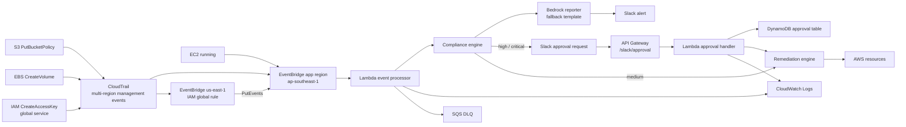
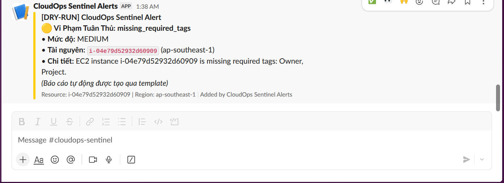
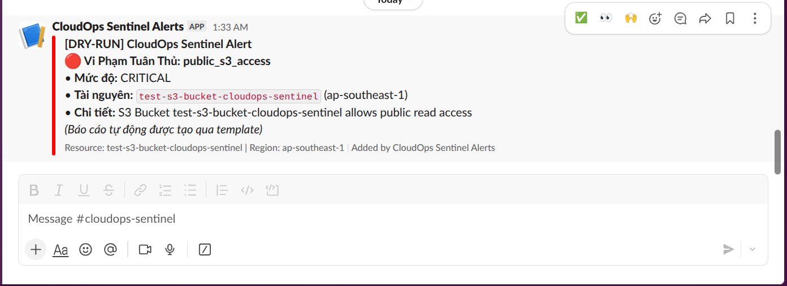
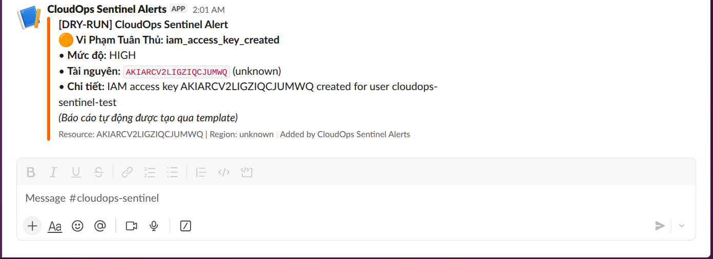
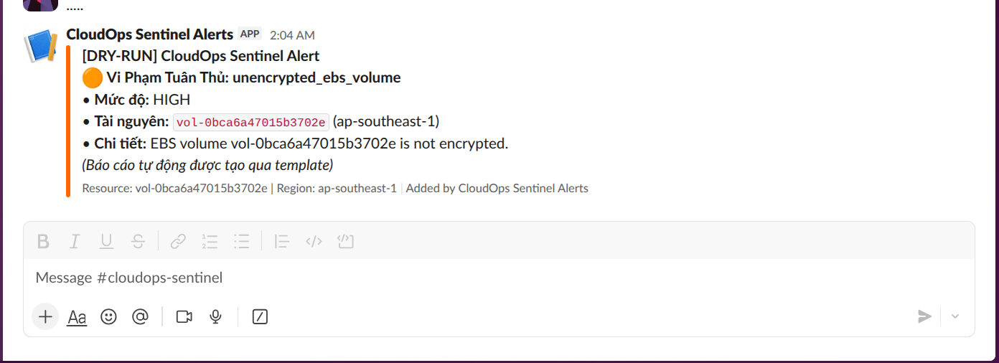
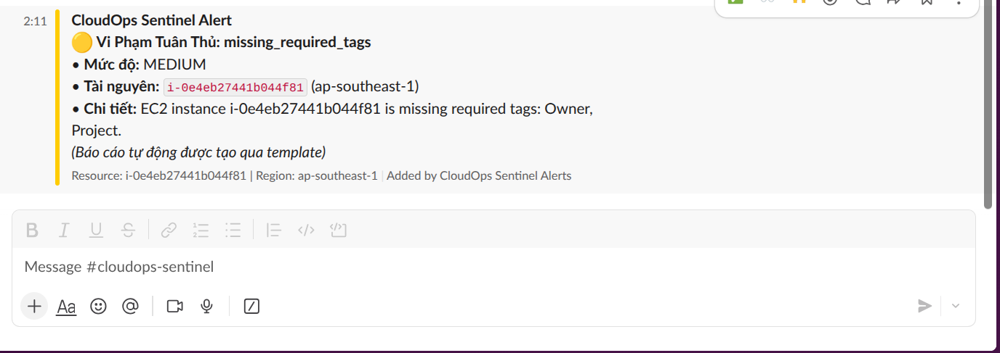
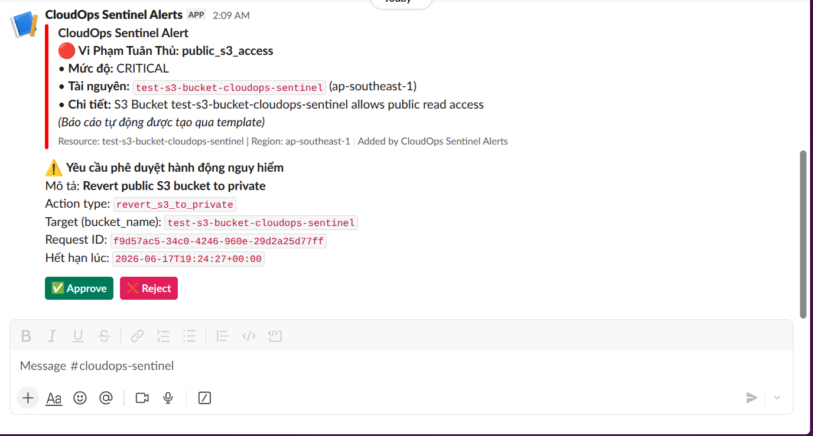
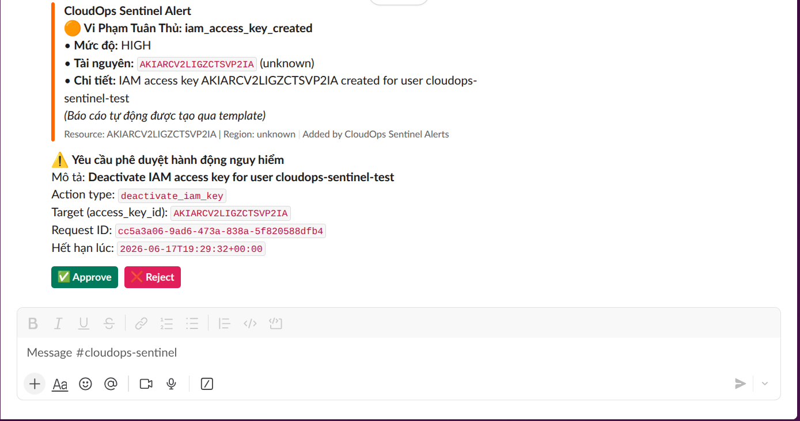
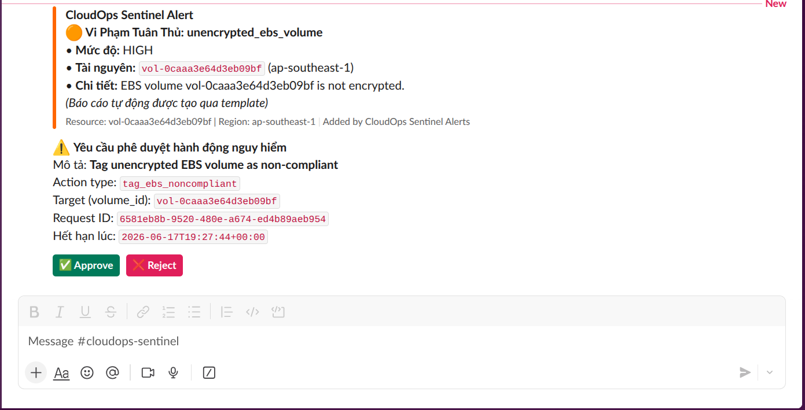

# CloudOps Sentinel

Automated cloud governance on AWS with Lambda, EventBridge, CloudTrail,
Terraform, Slack alerts, human approval, and safe remediation controls.

## What It Does

CloudOps Sentinel watches common AWS changes and checks them against four
guardrails:

| Guardrail | Detection event | Violation | Remediation |
|---|---|---|---|
| EC2 cost tags | EC2 instance enters `running` | Missing `Owner` or `Project` tag | Stop the instance |
| S3 public access | CloudTrail `PutBucketPolicy` | Public read/write bucket policy | Delete bucket policy |
| IAM access key | CloudTrail `CreateAccessKey` | New IAM access key | Deactivate access key |
| EBS encryption | CloudTrail `CreateVolume` | Unencrypted volume | Tag `Compliance-Status=Non-Compliant` |

Dry-run mode sends alerts and logs the intended remediation without changing
resources. Enforcement mode sends the same alert, then requires Slack approval
for high/critical actions before executing remediation.

## Architecture



Important implementation detail: IAM is a global service. `CreateAccessKey`
events appear in `us-east-1`, so Terraform creates an EventBridge forwarding
rule in `us-east-1` and sends those events back to the application region
default event bus.

## Screenshots

Dry-run mode:

| EC2 | S3 | IAM | EBS |
|---|---|---|---|
|  |  |  |  |

Enforcement mode:

| EC2 | S3 | IAM | EBS |
|---|---|---|---|
|  |  |  |  |

## Prerequisites

- AWS CLI configured for the dev account.
- Terraform installed.
- Python 3.11+.
- Slack incoming webhook stored in SSM Parameter Store as a SecureString.
- Slack app Interactivity enabled after Terraform prints the callback URL.

Create the Slack webhook parameter:

```bash
aws ssm put-parameter \
  --region ap-southeast-1 \
  --name /cloudops-sentinel/dev/slack/webhook-url \
  --type SecureString \
  --value "https://hooks.slack.com/services/..." \
  --overwrite
```

## Build Lambda Package

Terraform deploys the zip pointed to by
`terraform/environments/dev/dev.tfvars`. Build it before `terraform apply`.

```bash
rm -rf build/lambda_package_v6 build/cloudops-sentinel-lambda-v6.zip
mkdir -p build/lambda_package_v6

python3 -m pip install \
  --platform manylinux2014_x86_64 \
  --implementation cp \
  --python-version 3.11 \
  --only-binary=:all: \
  --target build/lambda_package_v6 \
  jsonschema urllib3

cp src/lambda/event_processor/handler.py build/lambda_package_v6/handler.py
cp -R src/lambda/shared build/lambda_package_v6/shared
cp -R src/lambda/compliance_engine build/lambda_package_v6/compliance_engine
cp -R src/lambda/remediation_engine build/lambda_package_v6/remediation_engine
cp -R config build/lambda_package_v6/config

cd build/lambda_package_v6
zip -r ../cloudops-sentinel-lambda-v6.zip .
cd ../..
```

## Deploy From Scratch

Create a local backend config file. This file is intentionally gitignored
because bucket names/account IDs are environment-specific.

```bash
ACCOUNT_ID="$(aws sts get-caller-identity --query Account --output text)"

cat > terraform/environments/dev/backend-dev.hcl <<'EOF'
bucket       = "cloudops-sentinel-tfstate-ACCOUNT_ID-dev"
key          = "cloudops-sentinel/dev/terraform.tfstate"
region       = "ap-southeast-1"
encrypt      = true
use_lockfile = true
EOF

sed -i "s/ACCOUNT_ID/${ACCOUNT_ID}/g" terraform/environments/dev/backend-dev.hcl

cat > terraform/environments/dev/dev.tfvars <<'EOF'
prefix                  = "cloudops-sentinel-dev"
environment             = "dev"
lambda_zip_path         = "../../../build/cloudops-sentinel-lambda-v6.zip"
dry_run_mode            = true
reserved_concurrency    = null
slack_webhook_ssm_param = "/cloudops-sentinel/dev/slack/webhook-url"
EOF
```

Initialize and deploy:

```bash
terraform -chdir=terraform/environments/dev init -backend-config=backend-dev.hcl
terraform -chdir=terraform/environments/dev validate
terraform -chdir=terraform/environments/dev plan -var-file=dev.tfvars -out=tfplan
terraform -chdir=terraform/environments/dev apply -auto-approve tfplan
```

After apply, copy the output `approval_callback_url` into the Slack app:

```text
Slack API -> Interactivity & Shortcuts -> Request URL
```

## Switching Dry-Run Mode

Edit `terraform/environments/dev/dev.tfvars`:

```hcl
dry_run_mode = true  # alerts only
dry_run_mode = false # enforcement mode
```

Apply the change:

```bash
terraform -chdir=terraform/environments/dev plan -var-file=dev.tfvars -out=tfplan
terraform -chdir=terraform/environments/dev apply -auto-approve tfplan
```

Verify Lambda environment variables:

```bash
aws lambda get-function-configuration \
  --region ap-southeast-1 \
  --function-name cloudops-sentinel-dev-event-processor \
  --query 'Environment.Variables.DRY_RUN_MODE' \
  --output text

aws lambda get-function-configuration \
  --region ap-southeast-1 \
  --function-name cloudops-sentinel-dev-approval-handler \
  --query 'Environment.Variables.DRY_RUN_MODE' \
  --output text
```

## Manual Test Guide

Use only disposable resources.

1. EC2: launch/start a small test instance without `Owner` and `Project` tags.
   In enforcement mode this is `medium` severity and can be stopped
   automatically.
2. S3: create a test bucket, disable Block Public Access for that bucket, and
   add a public read policy. In enforcement mode Slack approval deletes the
   bucket policy.
3. IAM: create a disposable IAM user and access key. Wait 1-3 minutes because
   IAM global events flow through `us-east-1`. In enforcement mode Slack
   approval deactivates the key.
4. EBS: create an unencrypted test EBS volume. In enforcement mode Slack
   approval tags it as `Compliance-Status=Non-Compliant`.

Useful logs:

```bash
aws logs tail /aws/lambda/cloudops-sentinel-dev-event-processor \
  --region ap-southeast-1 \
  --since 30m \
  --follow

aws logs tail /aws/lambda/cloudops-sentinel-dev-approval-handler \
  --region ap-southeast-1 \
  --since 30m \
  --follow
```

## Destroy And Cleanup

First destroy Terraform-managed resources:

```bash
terraform -chdir=terraform/environments/dev plan \
  -destroy \
  -var-file=dev.tfvars \
  -out=tf-destroy-plan

terraform -chdir=terraform/environments/dev apply -auto-approve tf-destroy-plan
```

If destroy fails because the CloudTrail log bucket is versioned/non-empty,
empty it and rerun destroy:

```bash
ACCOUNT_ID="$(aws sts get-caller-identity --query Account --output text)"
CLOUDTRAIL_BUCKET="cloudops-sentinel-dev-cloudtrail-${ACCOUNT_ID}"

aws s3 rm "s3://${CLOUDTRAIL_BUCKET}" --recursive

aws s3api list-object-versions \
  --bucket "${CLOUDTRAIL_BUCKET}" \
  --query '{Objects: Versions[].{Key:Key,VersionId:VersionId}}' \
  > /tmp/cloudtrail-versions.json

aws s3api delete-objects \
  --bucket "${CLOUDTRAIL_BUCKET}" \
  --delete file:///tmp/cloudtrail-versions.json

aws s3api list-object-versions \
  --bucket "${CLOUDTRAIL_BUCKET}" \
  --query '{Objects: DeleteMarkers[].{Key:Key,VersionId:VersionId}}' \
  > /tmp/cloudtrail-delete-markers.json

aws s3api delete-objects \
  --bucket "${CLOUDTRAIL_BUCKET}" \
  --delete file:///tmp/cloudtrail-delete-markers.json

terraform -chdir=terraform/environments/dev destroy -auto-approve -var-file=dev.tfvars
```

Then remove disposable manual test resources. Adjust names/IDs to match your
test run:

```bash
# S3 test bucket
TEST_BUCKET="test-s3-bucket-cloudops-sentinel"
aws s3api delete-bucket-policy --bucket "${TEST_BUCKET}" || true
aws s3 rm "s3://${TEST_BUCKET}" --recursive || true
aws s3api delete-bucket --bucket "${TEST_BUCKET}" || true

# IAM test user
TEST_USER="cloudops-sentinel-test"
aws iam list-access-keys \
  --user-name "${TEST_USER}" \
  --query 'AccessKeyMetadata[].AccessKeyId' \
  --output text

aws iam delete-access-key \
  --user-name "${TEST_USER}" \
  --access-key-id ACCESS_KEY_ID

aws iam delete-user --user-name "${TEST_USER}"

# EC2/EBS test resources
aws ec2 terminate-instances \
  --region ap-southeast-1 \
  --instance-ids INSTANCE_ID

aws ec2 delete-volume \
  --region ap-southeast-1 \
  --volume-id VOLUME_ID
```

Do not delete the Terraform remote state bucket during normal cleanup:

```text
cloudops-sentinel-tfstate-<account-id>-dev
```

That bucket is the state backend and is protected by `prevent_destroy`.

## Local Validation

```bash
python3 -m venv .venv
source .venv/bin/activate
pip install -r requirements.txt
pytest tests/ --cov=src
checkov -d terraform --framework terraform
```

Latest validated result during final testing:

- Unit tests: `169 passed`
- Coverage: `92%`
- Checkov: `0 failed` with documented skips
- Manual AWS screenshots: 8 total, covering dry-run on/off for EC2, S3, IAM,
  and EBS.

## Cost Estimate

Estimated monthly cost for a small dev workload:

| Service | Usage assumption | Estimated cost |
|---|---|---|
| Lambda | 100,000 invocations | ~$0.02 |
| EventBridge | 100,000 events | ~$0.10 |
| API Gateway HTTP API | Low approval traffic | ~$0.01 |
| DynamoDB on-demand | Small approval table | ~$0.01 |
| SQS DLQ | Minimal messages | ~$0.01 |
| CloudWatch Logs | 1 GB ingested | ~$0.53 |
| CloudTrail S3 logs | < 1 GB | ~$0.03 |
| Bedrock Claude 3 Haiku | 10,000 fallback/report attempts | ~$0.05 |
| Terraform state S3 | < 1 GB | ~$0.02 |
| **Total** | | **~$0.78/month** |

The value is approximate and assumes a small learning/dev account. Real cost
depends on event volume, log volume, and Bedrock usage.

## Notes

- `backend-dev.hcl`, `dev.tfvars`, build artifacts, screenshots, and local
  state-like files should be reviewed before commit according to your repo
  policy.
- Bedrock may fall back to a template report if model access is not enabled in
  the AWS account.
- Slack secrets are read from SSM Parameter Store so the webhook is not stored
  in Git or Lambda source code.
