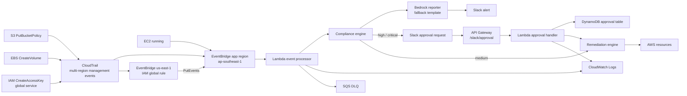

# CloudOps Sentinel

Quản trị đám mây tự động trên AWS với Lambda, EventBridge, CloudTrail, Terraform, cảnh báo Slack, phê duyệt của con người và các cơ chế khắc phục an toàn.

## Chức năng (What It Does)

CloudOps Sentinel giám sát các thay đổi phổ biến trên AWS và đối chiếu chúng với bốn guardrail:

| Guardrail | Sự kiện phát hiện | Vi phạm | Khắc phục |
|---|---|---|---|
| EC2 cost tags | EC2 instance chuyển sang trạng thái `running` | Thiếu tag `Owner` hoặc `Project` | Dừng (Stop) instance |
| S3 public access | CloudTrail `PutBucketPolicy` | Policy của bucket cho phép đọc/ghi công khai | Xóa bucket policy |
| IAM access key | CloudTrail `CreateAccessKey` | Access key IAM mới được tạo | Vô hiệu hóa (Deactivate) access key |
| EBS encryption | CloudTrail `CreateVolume` | Volume không được mã hóa | Gắn tag `Compliance-Status=Non-Compliant` |

Chế độ chạy thử (Dry-run) sẽ gửi cảnh báo và ghi log hành động khắc phục dự kiến mà không thay đổi tài nguyên. Chế độ thực thi (Enforcement) gửi cảnh báo tương tự, sau đó yêu cầu phê duyệt qua Slack đối với các hành động rủi ro cao/nghiêm trọng trước khi thực hiện khắc phục.

## Kiến trúc (Architecture)



Chi tiết triển khai quan trọng: IAM là một dịch vụ toàn cầu (global service). Các sự kiện `CreateAccessKey` xuất hiện ở `us-east-1`, vì vậy Terraform tạo một quy tắc chuyển tiếp EventBridge ở `us-east-1` và gửi các sự kiện đó về event bus mặc định của region chứa ứng dụng.

## Ảnh chụp màn hình (Screenshots)

Chế độ chạy thử (Dry-run):

| EC2 | S3 | IAM | EBS |
|---|---|---|---|
|  |  |  |  |

Chế độ thực thi (Enforcement):

| EC2 | S3 | IAM | EBS |
|---|---|---|---|
|  |  |  |  |

## Điều kiện tiên quyết (Prerequisites)

- Đã cấu hình AWS CLI cho account dev.
- Đã cài đặt Terraform.
- Python 3.11+.
- Slack incoming webhook được lưu trong SSM Parameter Store dưới dạng SecureString.
- Đã bật Interactivity cho Slack app sau khi Terraform in ra callback URL.

Tạo webhook parameter cho Slack:

```bash
aws ssm put-parameter \
  --region ap-southeast-1 \
  --name /cloudops-sentinel/dev/slack/webhook-url \
  --type SecureString \
  --value "https://hooks.slack.com/services/..." \
  --overwrite
```

## Đóng gói Lambda (Build Lambda Package)

Terraform triển khai file zip được trỏ tới bởi `terraform/environments/dev/dev.tfvars`. Hãy đóng gói nó trước khi chạy `terraform apply`.

```bash
rm -rf build/lambda_package_v6 build/cloudops-sentinel-lambda-v6.zip
mkdir -p build/lambda_package_v6

python3 -m pip install \
  --platform manylinux2014_x86_64 \
  --implementation cp \
  --python-version 3.11 \
  --only-binary=:all: \
  --target build/lambda_package_v6 \
  jsonschema urllib3

cp src/lambda/event_processor/handler.py build/lambda_package_v6/handler.py
cp -R src/lambda/shared build/lambda_package_v6/shared
cp -R src/lambda/compliance_engine build/lambda_package_v6/compliance_engine
cp -R src/lambda/remediation_engine build/lambda_package_v6/remediation_engine
cp -R config build/lambda_package_v6/config

cd build/lambda_package_v6
zip -r ../cloudops-sentinel-lambda-v6.zip .
cd ../..
```

## Triển khai từ đầu (Deploy From Scratch)

Tạo một file cấu hình backend cục bộ. File này cố ý được đưa vào gitignore vì tên bucket/ID tài khoản phụ thuộc vào môi trường cụ thể.

```bash
ACCOUNT_ID="$(aws sts get-caller-identity --query Account --output text)"

cat > terraform/environments/dev/backend-dev.hcl <<'EOF'
bucket       = "cloudops-sentinel-tfstate-ACCOUNT_ID-dev"
key          = "cloudops-sentinel/dev/terraform.tfstate"
region       = "ap-southeast-1"
encrypt      = true
use_lockfile = true
EOF

sed -i "s/ACCOUNT_ID/${ACCOUNT_ID}/g" terraform/environments/dev/backend-dev.hcl

cat > terraform/environments/dev/dev.tfvars <<'EOF'
prefix                  = "cloudops-sentinel-dev"
environment             = "dev"
lambda_zip_path         = "../../../build/cloudops-sentinel-lambda-v6.zip"
dry_run_mode            = true
reserved_concurrency    = null
slack_webhook_ssm_param = "/cloudops-sentinel/dev/slack/webhook-url"
EOF
```

Khởi tạo và triển khai:

```bash
terraform -chdir=terraform/environments/dev init -backend-config=backend-dev.hcl
terraform -chdir=terraform/environments/dev validate
terraform -chdir=terraform/environments/dev plan -var-file=dev.tfvars -out=tfplan
terraform -chdir=terraform/environments/dev apply -auto-approve tfplan
```

Sau khi apply thành công, sao chép `approval_callback_url` từ output vào Slack app:

```text
Slack API -> Interactivity & Shortcuts -> Request URL
```

## Chuyển đổi chế độ Dry-Run (Switching Dry-Run Mode)

Sửa đổi `terraform/environments/dev/dev.tfvars`:

```hcl
dry_run_mode = true  # alerts only
dry_run_mode = false # enforcement mode
```

Áp dụng thay đổi:

```bash
terraform -chdir=terraform/environments/dev plan -var-file=dev.tfvars -out=tfplan
terraform -chdir=terraform/environments/dev apply -auto-approve tfplan
```

Kiểm tra biến môi trường của Lambda:

```bash
aws lambda get-function-configuration \
  --region ap-southeast-1 \
  --function-name cloudops-sentinel-dev-event-processor \
  --query 'Environment.Variables.DRY_RUN_MODE' \
  --output text

aws lambda get-function-configuration \
  --region ap-southeast-1 \
  --function-name cloudops-sentinel-dev-approval-handler \
  --query 'Environment.Variables.DRY_RUN_MODE' \
  --output text
```

## Hướng dẫn kiểm tra thủ công (Manual Test Guide)

Chỉ sử dụng các tài nguyên có thể xóa được (disposable resources).

1. EC2: Khởi chạy/start một instance nhỏ dùng để test mà không có tag `Owner` và `Project`. Trong chế độ enforcement, điều này có mức độ nghiêm trọng (severity) `medium` và instance có thể bị dừng (stop) tự động.
2. S3: Tạo một test bucket, vô hiệu hóa Block Public Access cho bucket đó, và thêm một public read policy. Trong chế độ enforcement, phê duyệt trên Slack sẽ xóa policy của bucket.
3. IAM: Tạo một IAM user và access key dùng để test. Đợi 1-3 phút vì các sự kiện toàn cầu (global events) của IAM đi qua `us-east-1`. Trong chế độ enforcement, phê duyệt trên Slack sẽ vô hiệu hóa (deactivate) key.
4. EBS: Tạo một test EBS volume không được mã hóa. Trong chế độ enforcement, phê duyệt trên Slack sẽ gắn tag `Compliance-Status=Non-Compliant`.

Các log hữu ích:

```bash
aws logs tail /aws/lambda/cloudops-sentinel-dev-event-processor \
  --region ap-southeast-1 \
  --since 30m \
  --follow

aws logs tail /aws/lambda/cloudops-sentinel-dev-approval-handler \
  --region ap-southeast-1 \
  --since 30m \
  --follow
```

## Xóa và dọn dẹp (Destroy And Cleanup)

Đầu tiên, hủy (destroy) các tài nguyên được Terraform quản lý:

```bash
terraform -chdir=terraform/environments/dev plan \
  -destroy \
  -var-file=dev.tfvars \
  -out=tf-destroy-plan

terraform -chdir=terraform/environments/dev apply -auto-approve tf-destroy-plan
```

Nếu việc destroy thất bại vì bucket log CloudTrail đã được bật versioning/không trống, hãy dọn trống nó và chạy lại quá trình destroy:

```bash
ACCOUNT_ID="$(aws sts get-caller-identity --query Account --output text)"
CLOUDTRAIL_BUCKET="cloudops-sentinel-dev-cloudtrail-${ACCOUNT_ID}"

aws s3 rm "s3://${CLOUDTRAIL_BUCKET}" --recursive

aws s3api list-object-versions \
  --bucket "${CLOUDTRAIL_BUCKET}" \
  --query '{Objects: Versions[].{Key:Key,VersionId:VersionId}}' \
  > /tmp/cloudtrail-versions.json

aws s3api delete-objects \
  --bucket "${CLOUDTRAIL_BUCKET}" \
  --delete file:///tmp/cloudtrail-versions.json

aws s3api list-object-versions \
  --bucket "${CLOUDTRAIL_BUCKET}" \
  --query '{Objects: DeleteMarkers[].{Key:Key,VersionId:VersionId}}' \
  > /tmp/cloudtrail-delete-markers.json

aws s3api delete-objects \
  --bucket "${CLOUDTRAIL_BUCKET}" \
  --delete file:///tmp/cloudtrail-delete-markers.json

terraform -chdir=terraform/environments/dev destroy -auto-approve -var-file=dev.tfvars
```

Sau đó, xóa các tài nguyên test thủ công. Chỉnh sửa tên/ID cho phù hợp với lần test của bạn:

```bash
# S3 test bucket
TEST_BUCKET="test-s3-bucket-cloudops-sentinel"
aws s3api delete-bucket-policy --bucket "${TEST_BUCKET}" || true
aws s3 rm "s3://${TEST_BUCKET}" --recursive || true
aws s3api delete-bucket --bucket "${TEST_BUCKET}" || true

# IAM test user
TEST_USER="cloudops-sentinel-test"
aws iam list-access-keys \
  --user-name "${TEST_USER}" \
  --query 'AccessKeyMetadata[].AccessKeyId' \
  --output text

aws iam delete-access-key \
  --user-name "${TEST_USER}" \
  --access-key-id ACCESS_KEY_ID

aws iam delete-user --user-name "${TEST_USER}"

# EC2/EBS test resources
aws ec2 terminate-instances \
  --region ap-southeast-1 \
  --instance-ids INSTANCE_ID

aws ec2 delete-volume \
  --region ap-southeast-1 \
  --volume-id VOLUME_ID
```

Không xóa bucket chứa Terraform remote state trong quá trình dọn dẹp bình thường:

```text
cloudops-sentinel-tfstate-<account-id>-dev
```

Bucket này là state backend và được bảo vệ bởi `prevent_destroy`.

## Kiểm tra cục bộ (Local Validation)

```bash
python3 -m venv .venv
source .venv/bin/activate
pip install -r requirements.txt
pytest tests/ --cov=src
checkov -d terraform --framework terraform
```

Kết quả đã xác thực mới nhất trong lần test cuối cùng:

- Unit tests: `169 passed`
- Coverage: `92%`
- Checkov: `0 failed` cùng với các ngoại lệ (skips) đã được ghi nhận.
- Ảnh chụp AWS thủ công: tổng cộng 8 ảnh, bao gồm chế độ dry-run bật/tắt cho EC2, S3, IAM, và EBS.

## Ước tính chi phí (Cost Estimate)

Ước tính chi phí hàng tháng cho một lượng công việc (workload) dev nhỏ:

| Dịch vụ (Service) | Giả định mức sử dụng | Chi phí ước tính |
|---|---|---|
| Lambda | 100,000 lần gọi (invocations) | ~$0.02 |
| EventBridge | 100,000 sự kiện (events) | ~$0.10 |
| API Gateway HTTP API | Lượng truy cập phê duyệt thấp | ~$0.01 |
| DynamoDB on-demand | Bảng phê duyệt nhỏ | ~$0.01 |
| SQS DLQ | Rất ít messages | ~$0.01 |
| CloudWatch Logs | 1 GB dữ liệu nạp vào | ~$0.53 |
| CloudTrail S3 logs | < 1 GB | ~$0.03 |
| Bedrock Claude 3 Haiku | 10,000 lần tạo report/fallback | ~$0.05 |
| Terraform state S3 | < 1 GB | ~$0.02 |
| **Tổng cộng** | | **~$0.78/tháng** |

Giá trị này là gần đúng và giả định đây là một account học tập/dev nhỏ. Chi phí thực tế phụ thuộc vào số lượng sự kiện, dung lượng log và việc sử dụng Bedrock.

## Ghi chú (Notes)

- Các tệp `backend-dev.hcl`, `dev.tfvars`, các tạo tác (build artifacts), ảnh chụp màn hình, và các file mang tính chất trạng thái cục bộ (local state-like files) cần được xem xét lại trước khi commit theo chính sách repository của bạn.
- Bedrock có thể chuyển sang một template report mặc định nếu quyền truy cập mô hình chưa được bật trong AWS account của bạn.
- Các secret của Slack được đọc từ SSM Parameter Store, do đó webhook không bị lưu lại trong Git hay mã nguồn Lambda.
